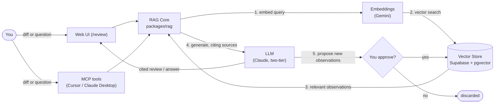

# Engram AI

> A RAG-plus-culture system: engineers (or agents) contribute distilled observations, and every future code review, Q&A, or PR analysis retrieves and cites them. Corrections propagate — the system learns.

Engram AI is built around the "Agent Culture" idea — AI systems that share a persistent, editable knowledge substrate they both **read from** and **write to**. That write-back loop (the _reflector_) is the differentiator over generic "chat with your docs" RAG.

*An [engram](https://en.wikipedia.org/wiki/Engram_(neuropsychology)) is a neuroscience term for a memory trace stored in the brain — exactly what the `observations` table is.*

---

## The one demo that explains everything

1. Paste a git diff into **/review**.
2. The system derives a search query, retrieves relevant observations from a shared memory, and writes a review that **cites** them as `[#n]`.
3. After the review, a _reflector_ proposes new observations distilled from the diff. You **approve** the good ones.
4. The next similar diff now retrieves what you just saved. **That loop is the whole project.**

The seeded memory already contains _"Don't derive state with useEffect"_, so the sample diff (which reintroduces that anti-pattern) gets flagged with a citation on the very first run.

---

## How RAG works here (the mental model)



Two independent paths meet at one store: observation text is embedded and written to pgvector on the WRITE side; a diff or question is turned into a query, embedded, and matched against that same store by cosine similarity on the READ side. Key idea: **embeddings are for search, the LLM is for reasoning, and they never touch each other** — the LLM only ever sees retrieved _text_, never a vector. Anthropic ships no embedding model on purpose — pairing Claude (generation) with Gemini (embeddings) is the standard production pattern, and it's exactly what the `EmbeddingProvider` / `LLMProvider` interfaces encode.

See [docs/ARCHITECTURE.md](docs/ARCHITECTURE.md#system-overview) for the full diagram and the provider interfaces that encode this.

---

## Architecture — one core, many interfaces

```
engram-ai/
├── apps/
│   ├── web/            Next.js 15 — UI (/review) + API routes (thin wrappers over the core)
│   └── mcp-server/     MCP server exposing the same core as tools
├── packages/
│   ├── shared/         domain types every package agrees on (Observation, Retrieved…)
│   ├── embeddings/     EmbeddingProvider interface + GeminiEmbeddingProvider
│   ├── vectorstore/    VectorStore interface + SupabaseVectorStore + schema.sql
│   ├── llm/            LLMProvider interface + ClaudeLLMProvider (haiku + sonnet tiers)
│   └── rag/            THE CORE: reviewDiff · ask · reflect · addObservation + the seeder
```

Every capability lives in `packages/rag` and is called identically from the Next.js routes and the MCP server. The provider interfaces mean any single backend swaps without the pipeline noticing; `ragFromEnv()` is the _only_ place the concrete Gemini/Supabase/Claude choices are named.

**Two-tier Claude** keeps costs down: `claude-haiku-4-5` for the cheap prep calls (deriving a query, reflecting), `claude-sonnet-4-6` for the user-facing review.

Full component diagram, sequence diagrams, and the DB schema are in **[docs/ARCHITECTURE.md](docs/ARCHITECTURE.md)**.

---

## Setup

**Prerequisites:** Node ≥ 20, pnpm, and a Supabase project (free tier).

```bash
pnpm install
cp .env.example .env      # then fill in the three keys below
```

Fill `.env` (see `.env.example` for links):

| Var | Where | Free? |
| --- | --- | --- |
| `ANTHROPIC_API_KEY` | console.anthropic.com | you have credits |
| `GOOGLE_API_KEY` | aistudio.google.com/apikey | yes — 1,500 req/day, no card |
| `SUPABASE_URL` / `SUPABASE_ANON_KEY` / `SUPABASE_SERVICE_ROLE_KEY` | Supabase → Settings → API | yes |

**Create the schema:** open Supabase → SQL Editor → paste and run
[`packages/vectorstore/src/schema.sql`](packages/vectorstore/src/schema.sql). This creates the
`observations` table, the pgvector HNSW index, and the `match_observations()` search function.

**Seed the memory:**

```bash
pnpm seed        # embeds + inserts ~24 starter observations
```

**Run:**

```bash
pnpm dev         # http://localhost:3000  → open /review
```

---

## Retrieval mechanics worth knowing

- **Metadata pre-filter before kNN.** `match_observations()` applies `type` / `technology` / `repository` filters in the `WHERE` clause _before_ ranking by vector distance. Smaller candidate set = faster and more accurate. (The single highest-value practice in this whole thing.)
- **Cosine distance** via pgvector's `<=>` operator; `similarity = 1 - distance`, surfaced in the "Why retrieved" panel so retrieval is never a black box.
- **`embedding_model` on every row** is migration insurance: swap embedders later and you know exactly which rows need re-embedding.

---

## Roadmap

- **M1 (this)** — Reviewer + culture loop end to end. ✅ scaffolded here.
- **M2** — `/ask` free-form Q&A with streaming + metadata-filter chips. (`packages/rag/ask.ts` is ready.)
- **M3** — multi-role: split `code_reviewer` / `standards_agent` / `docs_agent`, each with its own retrieval scope over the same memory.
- **M4** — MCP server in `apps/mcp-server/` exposing `search_observations` / `review_diff` / `ask` as tools — the same core, reachable from Claude Desktop / Cursor.
- **Stretch** — swap `GeminiEmbeddingProvider` → a Cloudflare Qwen3 provider and A/B retrieval quality (the `embedding_model` column makes this clean).

---

## Where to start reading the code

For the full architecture (diagrams, data flow, schema), see **[docs/ARCHITECTURE.md](docs/ARCHITECTURE.md)** — and **[docs/LEARNINGS.md](docs/LEARNINGS.md)** for the engineering decisions and gotchas behind them. To start reading code directly:

1. [`packages/shared/src/types.ts`](packages/shared/src/types.ts) — the vocabulary.
2. [`packages/rag/src/reviewDiff.ts`](packages/rag/src/reviewDiff.ts) — the full read→reason→reflect pipeline in ~60 lines.
3. [`packages/rag/src/reflect.ts`](packages/rag/src/reflect.ts) — the write-back loop that makes this "culture," not just search.
4. [`packages/vectorstore/src/schema.sql`](packages/vectorstore/src/schema.sql) — where the pre-filter + kNN actually happen.
