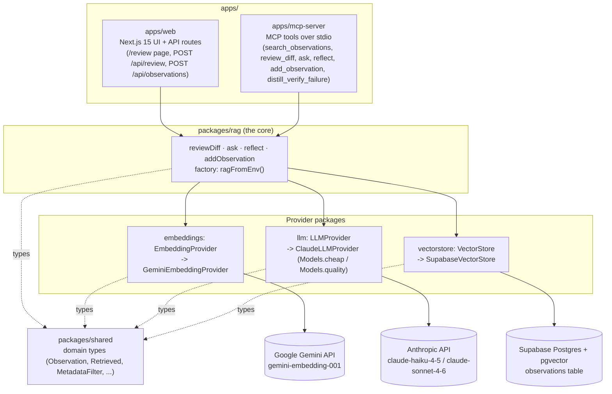
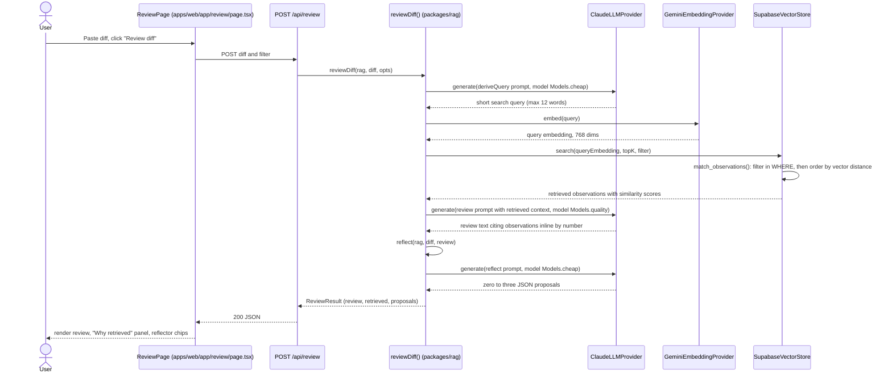
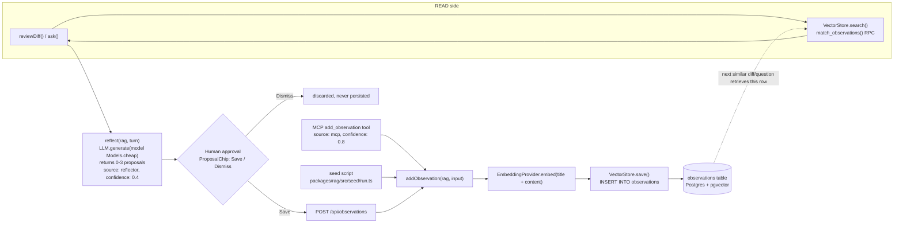
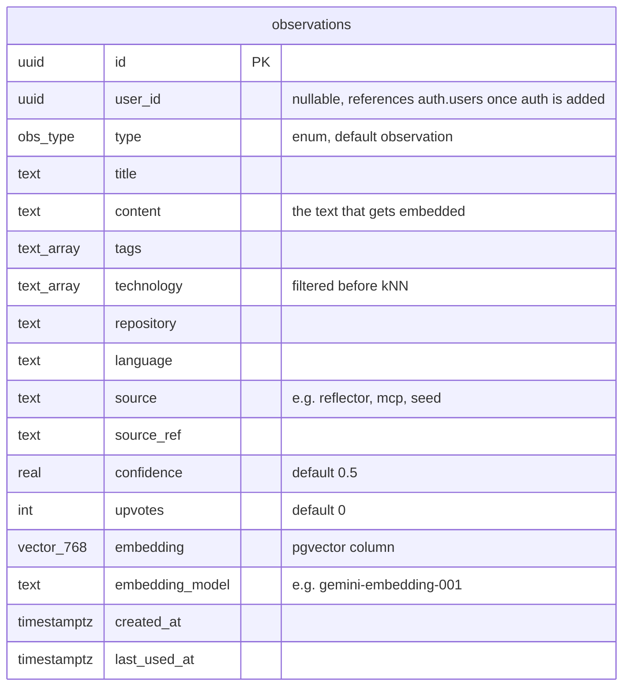

# Architecture

This document is the technical deep-dive companion to the [README](../README.md) — the pitch, demo walkthrough, and quickstart live there. This covers system structure, data/control flow, and the storage schema in detail.

## System Overview

The repo is a pnpm monorepo with a strict dependency direction: `shared` has zero dependencies; `embeddings`, `llm`, and `vectorstore` depend only on `shared`; `rag` composes all three providers; `apps/*` depend on `rag` and never reach past it. Only `packages/rag/src/factory.ts` (`ragFromEnv()`) names concrete provider classes — everything downstream takes the `Rag` interface and never imports a concrete implementation. This is what lets the web app and the MCP server share one core with zero duplication.



## Core Abstractions

Three provider interfaces are the entire contract between `packages/rag` and the outside world.

```typescript
// packages/embeddings/src/provider.ts
interface EmbeddingProvider {
  embed(text: string): Promise<number[]>;
  embedBatch(texts: string[]): Promise<number[][]>;
  readonly model: string;        // e.g. 'gemini-embedding-001'
  readonly dimensions: number;   // e.g. 768, must match schema.sql vector(N)
}

// packages/vectorstore/src/provider.ts
interface VectorStore {
  save(input: ObservationInput & { embedding: number[]; embeddingModel: string }): Promise<string>;
  search(queryEmbedding: number[], opts: { topK: number; filter?: MetadataFilter }): Promise<Retrieved[]>;
  get(id: string): Promise<Observation | null>;
}

// packages/llm/src/provider.ts
interface LLMProvider {
  generate(messages: ChatMessage[], opts?: LLMOpts): Promise<string>;
  stream(messages: ChatMessage[], opts?: LLMOpts): AsyncIterable<string>;
}
const Models = { cheap: "claude-haiku-4-5", quality: "claude-sonnet-4-6" };
```

**Two-tier Claude:** `Models.cheap` (haiku) handles the high-frequency, low-stakes calls — deriving a retrieval query, generating reflection proposals. `Models.quality` (sonnet) is reserved for the single generation the user actually reads: the review or answer text. Cost scales with the cheap tier; quality is spent where it's seen.

## The Review Pipeline

`reviewDiff(rag, diff, opts)` in `packages/rag/src/reviewDiff.ts` runs five steps:

1. **Derive a query** — a cheap-tier call turns the noisy diff into a focused, ≤12-word search query.
2. **Embed the query** — the derived query is embedded (Gemini).
3. **Retrieve** — `VectorStore.search()` runs `match_observations()`, which applies the metadata pre-filter in SQL before ranking by vector distance.
4. **Generate the review** — a quality-tier call produces the review text, citing retrieved observations inline by number.
5. **Reflect** — the diff and review are handed to `reflect()`, which proposes 0-3 new observations (see below). These are returned, not persisted.



`ask(rag, question, opts)` in `packages/rag/src/ask.ts` follows a shorter path: it embeds the question directly (no query-derivation step), retrieves, and streams a quality-tier answer alongside the retrieved observations.

## The Culture Loop (Write-Back)

`reflect()` never persists anything — it returns candidate `ObservationInput` proposals, each pre-set to `source: "reflector"` and `confidence: 0.4`, low until a human vouches for them. The UI renders each as a chip with Save/Dismiss; only Save calls `POST /api/observations`, which calls `addObservation()`.

`addObservation(rag, input)` is the single convergence point for persistence: it embeds `title + content`, then writes the row via `VectorStore.save()`. Three paths call it today:

- The reflector's approved chips, via `POST /api/observations`.
- The seed script (`packages/rag/src/seed/run.ts`), which seeds the initial observation set.
- The MCP `add_observation` tool, defaulting to `source: "mcp"`, `confidence: 0.8`.

A manual "Add Observation" UI form doesn't exist yet — only these three paths write today (see the README Roadmap).



## Data Model

The `observations` table is the entire schema (`packages/vectorstore/src/schema.sql`). The `obs_type` enum must stay in sync across three files — `schema.sql`, `packages/shared/src/types.ts`, and the `VALID_TYPES` set in `packages/rag/src/reflect.ts` — see `.claude/rules/types.md`.



Indexes: HNSW on `embedding` (`vector_cosine_ops`, pairs with the `<=>` cosine-distance operator), GIN on `technology` (accelerates the pre-filter), btree on `type`. The 8 `obs_type` values: `observation`, `best_practice`, `adr`, `pattern`, `incident`, `security`, `performance`, `team_standard`.

`match_observations(query_embedding, match_count, filter_types, filter_tech, filter_repo, filter_language)` applies the metadata filters in `WHERE` first, then orders by `embedding <=> query_embedding` (cosine distance), returning `similarity = 1 - distance`.

## Retrieval Mechanics

- **Metadata pre-filter before kNN.** `match_observations()` applies `type`/`technology`/`repository`/`language` filters in the `WHERE` clause _before_ ranking by vector distance. A smaller candidate set is both faster and more accurate.
- **Cosine distance** via pgvector's `<=>` operator; `similarity = 1 - distance`, surfaced in the UI's "Why retrieved" panel.
- **`embedding_model` on every row** is migration insurance: swap embedders later and you know exactly which rows need re-embedding.

## Interfaces Over the Core

`apps/web` exposes two thin API routes and two pages:

- `POST /api/review` → `reviewDiff()`
- `POST /api/observations` → `addObservation()`
- `/` — landing page
- `/review` — the reviewer UI (diff input, review output, "Why retrieved" panel, reflector chips)

`apps/mcp-server` exposes the same core as six MCP tools, each a thin wrapper over `@em/rag`:

| Tool | Wraps |
| --- | --- |
| `search_observations` | Embed + `VectorStore.search()` |
| `review_diff` | `reviewDiff()` |
| `ask` | `ask()`, drained server-side into one string |
| `reflect` | `reflect()` — proposals only |
| `add_observation` | `addObservation()` |
| `distill_verify_failure` | `distillVerifyFailure()` — turns a failed `pnpm verify` run into incident-type proposals |

Both interfaces call the identical `packages/rag` functions — this is the "one core, many interfaces" claim made concrete.

## Provider Swap Points

To add or swap a provider: define (or extend) the interface in that package's `provider.ts`, implement a class satisfying it, then wire the new class into `packages/rag/src/factory.ts`'s `ragFromEnv()`. Nothing downstream of `factory.ts` changes. The motivating example already on the roadmap: swapping `GeminiEmbeddingProvider` for a Cloudflare Qwen3 provider to A/B retrieval quality — the `embedding_model` column on every row makes that migration traceable.

## Related Docs

- [README.md](../README.md) — pitch, demo walkthrough, setup, roadmap.
- [AGENTS.md](../AGENTS.md) — cross-tool agent context (Cursor, Claude Code).
- [docs/LEARNINGS.md](LEARNINGS.md) — the engineering decisions and gotchas behind this architecture.
